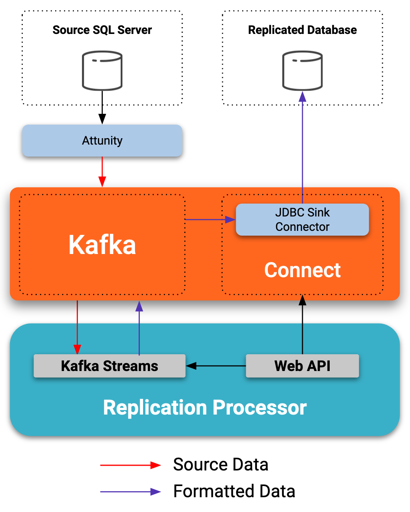

# Replication Processor

## Motivation

This projects leverages Kafka Streams and Kafka Connect to offer an opinionated control pane to declare replication pipelines between two external data sources. This control plane currently interfaces as a Web Service.

This application takes your declarative `Replication Definition` manifest and instanciates the underlying Kafka Connectors as well as the required Streams Processor to transform the source data to a format expected by the destination supported datasources. Avro is required as it guarantees the right mapping between the sources and sinks.

The amount of configurable options is intented to serve simplicity over flexibility.

Ultimately, the goal of this project is to offer a simplified DSL to manage the flow of realtime ETL pipelines which constrats with the current requirement of configuring Kafka Connectors manually and writing custom Kafka Streams applications. 

The vision of this project aims to offer a DSL with different clients, enabling a a tooling ecosystem can be built to help designing and testing data integration pipelines.

[](https://docs.google.com/presentation/d/110TxZYo65zt5EIdbHOjKr6q7r-_FHvgv1T9tlrLlM28)

The supported sources are:

* Debezium CDC for SqlServer
* Any topic fed by Attunity

The supported destinations are:

* SqlServer

## Upcoming improvements 
* Sources:
  * Debezium for MySQL
  * MongoDB
* Sinks
  * MySQL
  * PostgreSQL
  * Oracle
  * SQLite
  * MongoDB
* Management UI (Maybe?)

## Quickstart

### Pre requisites to run the Replication Processor locally

* Java 8
* Docker and docker-compose (to run the infrastructure for local testing)
* A Kafka cluster
* A Connect cluster
* Schema Registry (Avro is used to do type mapping between the destination and the source)

### Deploying the infrastructure locally

The `docker-compose.yml` from this repository provides all the infrastructure to run locally and testing 

```
$ docker-compose up -d
```

### Building an executable binary

```
$ ./mvnw -f processor/pom.xml clean package
```

### Run the executable binary

```
java -jar processor/target/replication-processor.jar
```

### Create a Replication Definition

```
curl -X POST http://localhost:8080/replication-definition \
  -H "Content-Type: application/json"  \
  --data-binary @- << EOF
{
  "name":"test",
  "sourceTopic":{
    "name":"cdc-pricing-publish",
    "compacted":false,
    "partitions":1,
    "replicationFactor":1
  },
  "source":{
    "type":"SQLSERVER",
    "valueFormat":"JSON",
    "debeziumSqlServerConfiguration": {
      "hostname": "replicated-db",
      "port": "1433",
      "user": "SA",
      "password": "Password!",
      "dbname": "tests",,
      "serverName": "replicated-db",
    }
  },
  "sinkTopic":{
    "name":"PricingPublish",
    "compacted":false,
    "partitions":1,
    "replicationFactor":1
  },
  "sinkValueFormat":"AVRO",
  "sinkSchema": "\
    {\n\
      \"type\": \"record\",\n\
      \"name\": \"PricingPublish\",\n\
      \"namespace\": \"io.daniellavoie.replication.processor\",\n\
      \"fields\": [\n\
        {\n\
          \"name\": \"KeyEMDPricing\",\n\
          \"type\": {\"type\": \"string\"}\n\
        },\n\
        {\n\
          \"name\": \"KeyInstrument\",\n\
          \"type\": \"int\"\n\
        },\n\
        {\n\
          \"name\": \"InstrumentValueAsOf\",\n\
          \"type\": {\"type\" : \"long\", \"logicalType\" : \"timestamp-millis\"}\n\
        },\n\
        {\n\
          \"name\": \"KeyInstrumentSource\",\n\
          \"type\": \"int\"\n\
        },\n\
        {\n\
          \"name\": \"KeyInstrumentLocation\",\n\
          \"type\": \"int\"\n\
        },\n\
        {\n\
          \"name\": \"KeyInstrumentMeasure\",\n\
          \"type\": \"int\"\n\
        },\n\
        {\n\
          \"name\": \"InstrumentValue\",\n\
          \"type\": \"double\"\n\
        },\n\
        {\n\
          \"name\": \"InstrumentDeliveryStart\",\n\
          \"type\": {\"type\" : \"long\", \"logicalType\" : \"timestamp-millis\"}\n\
        },\n\
        {\n\
          \"name\": \"InstrumentDeliveryEnd\",\n\
          \"type\": {\"type\" : \"long\", \"logicalType\" : \"timestamp-millis\"}\n\
        },\n\
        {\n\
          \"name\": \"UpdOperation\",\n\
          \"type\": \"int\"\n\
        },\n\
        {\n\
          \"name\": \"UpdDate\",\n\
          \"type\": {\"type\" : \"long\", \"logicalType\" : \"timestamp-millis\"}\n\
        },\n\
        {\n\
          \"name\": \"ActiveRow\",\n\
          \"type\": \"boolean\"\n\
        },\n\
        {\n\
          \"name\": \"InstrumentValuePublishDate\",\n\
          \"type\": {\"type\" : \"long\", \"logicalType\" : \"timestamp-millis\"}\n\
        }\n\
      ]\n\
    }",
  "sinks":[
    {
      "sqlServerConfiguration":{
        "connectionUrl":"jdbc:sqlserver://replicated-db:1433",
        "user":"SA",
        "password":"Password!",
        "pkFields":"KeyEMDPricing"
      },
      "type":"SQLSERVER",
      "tasksMax":1,
      "name":"sql-server"
    }
  ]
}

EOF
```

### Inspect Control Center

Control Center can be opened from http://localhost:9021 and will let you inspect the topics and connector created automatically by the Replication Processor.

### Generate some fake data in the source topic

```
$ ./mvnw -f integration-tests/replication-processor/pom.xml
```

### Accessing the sink database to valide the rows have been replicated successfully

```
$ docker exec -it replication-replicated-db bash -c '/opt/mssql-tools/bin/sqlcmd -U sa -P Password!'

1> SELECT count(1) from PricingPublish;
1> go
```

## Configuration reference

### Overwriting the default configurations

Default configuration are intended for local testing with the services provided by the `docker-compose.yml` file. The default configuration can be overwritten for both the Replication Processor and the integrations test suites.

### Configuring the Replication Processor with command line arguments

The Replication Processor is a Spring Boot application. As such, you can configure your Kafka bootstrap server using Spring Boot properties.

```
$ java -jar processor/target/replication-processor.jar \
  --spring.kafka.bootstrap-servers=my-kafka-bootstrap-server:9092
  --spring.kafka.properties.sasl.mechanism=PLAIN
  --spring.kafka.properties.sasl.jaas.config=org.apache.kafka.common.security.plain.PlainLoginModule required username=\"my-kafka-sasl-key\" password=\"my-kafka-sasl-secret\";
  --spring.kafka.properties.security.protocol=SASL_SSL
  --spring.kafka.properties.ssl.endpoint.identification.algorithm=https
  --spring.kafka.streams.replication-factor=3
  --spring.kafka.properties.basic.auth.credentials.source=USER_INFO
  --spring.kafka.properties.schema.registry.url=https://my-schema-registry-server
  --spring.kafka.properties.schema.registry.basic.auth.user.info=my-schema-registry-key:my-schema-registry-secret
  --connect.url=https://my-connect-rest-url
  --connect.basic.user=my-connect-user
  --connect.basic.password=my-connect-password
```

### Configuring the Replication Processor with environment variables

Being a Spring Boot application, environment variables will be picked up by the Replication Processor.

```
$ export SPRING_KAFKA_BOOTSTRAPSERVERS=my-kafka-bootstrap-server:9092
$ export SPRING_KAFKA_PROPERTIES_SASL_MECHANISM=PLAIN
$ export SPRING_KAFKA_PROPERTIES_SASL_JAAS_CONFIG=org.apache.kafka.common.security.plain.PlainLoginModule required username=\"my-kafka-sasl-key\" password=\"my-kafka-sasl-secret\";
$ export SPRING_KAFKA_PROPERTIES_SECURITY_PROTOCOL_SASL_SSL
$ export SPRING_KAFKA_PROPERTIES_SSL_ENDPOINT_IDENTIFICATION_ALGORITHM=https
$ export SPRING_KAFKA_STREAMS_REPLICATIONFACTORY=3
$ export SPRING_KAFKA_PROPERTIES_BASIC_AUTH_CREDENTIALS_SOURCE=USER_INFO
$ export SPRING_KAFKA_PROPERTIES_SCHEMA_REGISTRY_URL=https://my-schema-registry-server
$ export SPRING_KAFKA_PROPERTIES_REGISTRY_BASIC_AUTH_USER_INFO=my-schema-registry-key:my-schema-registry-secret
$ export CONNECT_URL=https://my-connect-rest-url
$ export CONNECT_BASIC_USER=my-connect-user
$ export CONNECT_BASIC_PASSWORD=my-connect-password

$ java -jar processor/target/replication-processor.jar
```

### Overwriting the configurations for the integration tests

Integration tests are available within `integration-tests/replication-processor` and runs with maven. The test suite runs as a Spring Boot Test project. As such, environment variables can be used to run the tests against a different environment than your local one.

This test suite expects a SqlServer instance to validate that the source data as been successfully replicated. The tests will setup the schema automatically given that the service account has the priviledges to create required tables.

#### !Warning!

The integration tests will delete any existing data in the `PricingPublish` table of your sink SqlServer database.

``` 
$ export SPRING_DATASOURCE_URL=jdbc:sqlserver://localhost:1433
$ export SPRING_DATASORUCE_USERNAME=SA
$ export SPRING_DATASOURCE_PASSWORD=Password!

$ export SPRING_KAFKA_BOOTSTRAPSERVERS=my-kafka-bootstrap-server:9092
$ export SPRING_KAFKA_PROPERTIES_SASL_MECHANISM=PLAIN
$ export SPRING_KAFKA_PROPERTIES_SASL_JAAS_CONFIG=org.apache.kafka.common.security.plain.PlainLoginModule required username=\"my-kafka-sasl-key\" password=\"my-kafka-sasl-secret\";
$ export SPRING_KAFKA_PROPERTIES_SECURITY_PROTOCOL_SASL_SSL
$ export SPRING_KAFKA_PROPERTIES_SSL_ENDPOINT_IDENTIFICATION_ALGORITHM=https
$ export SPRING_KAFKA_STREAMS_REPLICATIONFACTORY=3
$ export SPRING_KAFKA_PROPERTIES_BASIC_AUTH_CREDENTIALS_SOURCE=USER_INFO
$ export SPRING_KAFKA_PROPERTIES_SCHEMA_REGISTRY_URL=https://my-schema-registry-server
$ export SPRING_KAFKA_PROPERTIES_REGISTRY_BASIC_AUTH_USER_INFO=my-schema-registry-key:my-schema-registry-secret

$ ./mvnw -f integration-tests/replication-processor/pom.xml
```
